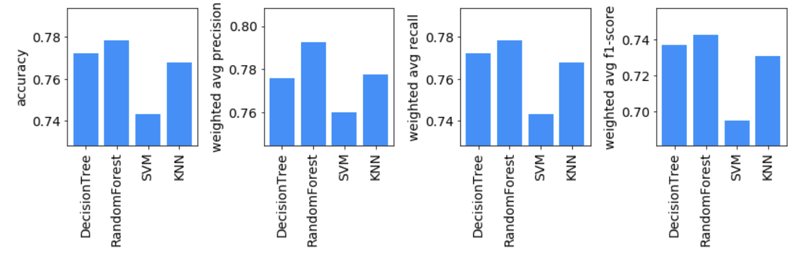
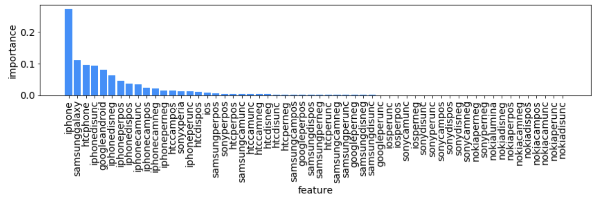
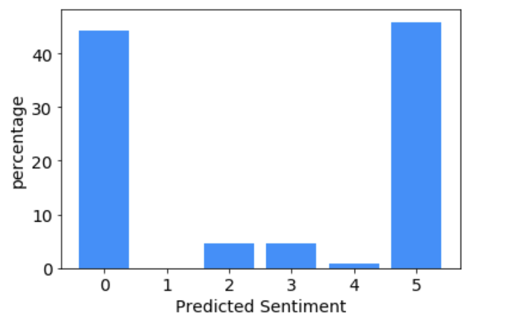

--
# 
 iPhone & Galaxy Cellphone Sentiment
--
 

 
__Alert! Analytics__ 
__Client: Helio__ 

July 7th 2019 

John T. Leonard 
<jtleona01@gmail.com> 

 
--
### Introduction
The client, Helio, is working with a government health agency to develop a suite of smartphone medical applications to be used by aid workers in developing countries. This application needs to be  deployed on either iPhone or Galaxy smartphones, and thus Helio has tasked Alert! Analytics with analyzing the customer sentiment for each smartphone, in order to determine the optimal platform to deploy the app on. In this report, we discuss the findings from analyzing customer sentiment using machine learning models. Following this discussion, we highlight degree of confidence in the results and discussion potential gaps & areas for improvement, before describing some implications. Finally, we conclude with a lower-level discussion of the methodology used in the analysis.

### Findings
To understand iPhone and galaxy sentiment for unlabeled data assembled from our map-reduce compiler on AWS, we began by training a number of machine learning models on a smaller subset of hand-labeled sentiment data. We evaluated 2 kinds of model pipelines, one using all the features from the dataset of interest, and one with a smaller selection of features based on a number of feature engineering/selection methods (high correlation filtering, low variance filtering, and recursive feature elimination). In the end, it was determined that the out-of-box models using all the available features from the dataset, could achieve the highest accuracy and model performance generally. For the out-of-box models, we evaluated four different types of models: (1) decision tree, (2) random forest, (3) support vector machine (SVM), and (4) K nearest neighbors (KNN). Each of these models have different methods for fitting & classifying data and their ability to perform this classification depends on the type of data you're trying to classify. For this particular application however, we discovered the random forest model to be the most optimal. The table below shows the relevant performance metrics for each of the models we evaluated. 

__iPhone Out of Box Model Metrics  
(evaluated on testing set)__ 

It should be noted that a grid-search with cross-validation was performed on each type of model, in an attempt to find the optimal hyperparameters (i.e. hard-coded settings) for that given class of model. In the figure above, we can see the random forest model achieved an accuracy of ~78%. This random forest model is actually and ensemble of decision trees, so it is not that surprising that the single decision tree model performed 2nd best, with an accuracy of ~77%. Beyond accuracy, it is also important to consider the precision, recall, and f1-scores for classification models. In typical binary classification problems, these metrics are straightforward since there are only 2 classes. However, in this problem, we have 6 classes (0-5 sentiment level), and thus we chose to use a weighted average for each of these metrics, where the precision, recall, or f1-score is weighted by the number of true instances for each label. The precision is defined as the number of true positive predictions / (true positives + false positives), while the recall is defined as the true positives / (true positives + false negatives). As can be seen, the random forest has the highest value for each of these metrics, thus it is by far the best model

Using the trained random forest model, we are able to determine the feature importance for iPhone sentiment classification. This breakdown is shown the the bar chart below.

__out-of-box random forest classifier average feature importance__

Here, we can see that the iPhone, Samsung galaxy, and HTC phone word counts are the most important features, suggesting that someones sentiment largely depends on which phone they mentioned. Considering this on a more intuitive level, this is not very surprising since often people review products to either say how awesome it is or to say how terrible it is, rather than talk about how ok, acceptable, or satisfying it is. Given this statement/realization, it is also not surprising that we found a fairly equal balance between positive and negative iPhone sentiments when we predicted sentiment from ~30000 reviews. The results of these sentiment predictions are shown below.

__Legend:__
0: very negative, 1: negative, 2: somewhat negative, 3: somewhat positive, 4: positive, 5: very positive

Overall, there are slightly more users who prefer iPhones (51%), however the margin is quite small. These leads to several conclusions: (1) Helio can choose iPhone or galaxy and ~50% of the users will likely complain about their experience, and (2) to more precisely understand the sentiment for each phone, we may need to employ a different form of data collection. With regards to the second conclusion, it seems that it may be more effective to actively interview/request feedback for phone sentiment, rather than just passively mining existing data. This is because by actively asking people to review or rate their phone experience, we are more likely to sample typical users who do not go and post phone reviews.

It should be noted that the results above were highlighted for the iPhone sentiment model, however the same procedure was performed focusing on galaxy sentiment alone. The results from the galaxy sentiment analysis were quite similar to the iPhone sentiment analysis, thus we did not find it useful to go into detail on those results as well.

### Confidence

As can be seen from our model performance metrics, our best model, the out-of-box random forest classifier, achieve an accuracy of ~78%, which implies that we are ~78% confident of the predicted sentiment shown the the bar chart with the sentiment distribution. That being said, it seems that the biggest uncertainty in this model is actually a result of the uncertainty in the validity of the training data. Specifically, it seems quite likely that this dataset generated by crawling user reviews, likely represents a skewed or extreme part of the real population, since users typically only write reviews when they are very happy or unhappy.

### Implications

The key implications highlighted previously are:  (1) Helio can choose iPhone or galaxy and ~50% of the users will likely complain about their experience, and (2) to more precisely understand the sentiment for each phone, we may need to employ a different form of data collection. To some extent these insights are good news for Helio because it basically means that they aren't at risk of choosing the wrong phone set. However, it also implies that user reviews of this form are not good metrics of real user preference for phones or even apps. Generally, the fact that we cannot say users prefer iPhone or galaxy also implies that it may be more important for Helio to focus on other metrics, such as phone lifetime, cost, or some other feature. Furthermore, the uncertainty in the user preferences from the available data suggest that it maybe be extremely important for Helio to implement some kind of user experience tracking in their application itself, either by passively tracking the hours of app use, our by pinging users to submit a rating after using the app.

### Methodology
This analysis was carried out primarily in Jupyter Notebook running a python 3 kernel. Two sample datasets ("small matrix datasets") containing manually labeled sentiment scores from 0-5 (very negative to very positive) for iPhone & Galaxy smartphones, along with numerous features, were used to develop the models for predicting sentiment. Prior to training the models, a preliminary inspection was carried out to observe the distributions in the features & label of interest. Furthermore, this inspection ensured the datasets were clean. Following this inspection, two pipelines were setup to train the models. The first pipeline's purpose was to evaluate model performance without any feature engineering/selection (i.e. out-of-box). The second pipeline leveraged strong cross-correlation feature filtering, low variance feature filtering, and recursive feature elimination (RFE) to down-select the original features into a set of key features from which all proceeding models were trained. 

For each pipeline (out-of-box & feature selected), a train-test split with a test size of 30% was carried out prior to model training. Each of the metrics reported above were evaluated on the testing set after training. 4 types of classification models were evaluated:

1. Decision Tree
2. Random Forest
3. Support Vector Machine (SVM)
4. K Nearest Neighbors (KNN)

Each of these models is defined by a number of hyperparameters (hard-coded parameters defined at the start of training). To attempt to determine the optimal set of hyperparameters for each model, a hyperparameter grid-search with 5-fold cross validation was carried out. In total > 1000 candidate models were evaluated.

Following training, the best of best (BoB) model from the out-of-box pipeline and the feature selected pipeline were selected. These BoB models were selected based on their accuracy, however we were careful to also consider the f1-score in comparing the models as well.

Finally, from the BoB model for each pipeline, we selected the BoB of BoBs as our final model for prediction on our field data. The field data, or "Large Matrix Data" was previously compiled using a map-reduce algorithm via AWS. Using our BoB of BoBs model, we predicted the sentiment scores for the unlabeled Large Matrix data. 

This procedure was performed for both Galaxy & iPhone datasets to determine the optimal model for each respectively.