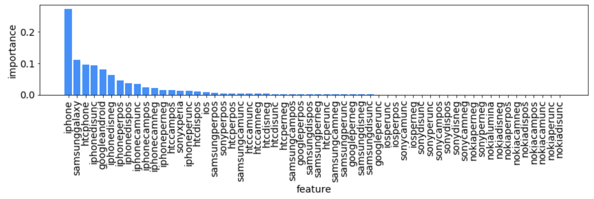
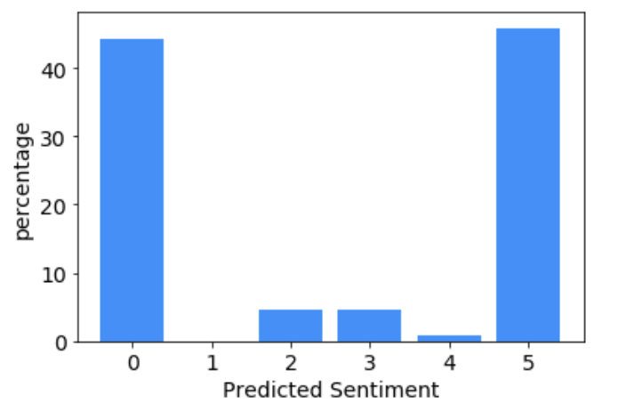

--
# 
 C04T03 Develop Models to Predict Sentiment
# 
 Lessons Learned
--

July 9th 2019 

John T. Leonard 
<jtleona01@gmail.com> 

--
## Exploratory Data Analysis (EDA)
To get a rough idea of the distribution of the data, we started by plotting the histograms for each of the features in the iPhone small matrix dataset. The histograms for the first 3 features are shown below.

Note that the counts are plotted on a log-scale. This is of particular note because it highlights that the features generally were very sparse in nature (most of the data points consisted of zeros) which can make getting an intuitive understanding of the feature and label correlations somewhat tricky. 

Aside from the feature distributions, we also inspected the label distributions. The histograms for the label of interest (iPhone sentiment) is shown below.

Here, we can see that the label classes are very unevenly distributed. This can be an issue when training the models, since it basically places more weight on learning to predict the class with the highest counts. There are some methods to deal with this, such as down-sampling or over-sampling, however we did not explore such approaches in this task.

Overall, I found this dataset a bit tricky because it consisted of features that just stated word counts corresponding to class/item, such counts of mentions of iOS, or galaxy negative sentiment (galaxydisneg). I found the features that counted sentiment instances to be particularly confusing, because our objective was to try to predict the sentiment label. I think it may have been more clear if these features were specified as counts of negative or positive words, rather than negative sentiment mentions.

## Feature Engineering / Selection
Following the preliminary EDA, we proceeded to carry build 3 feature engineering / selection functions: (1) strong cross-correlation filtering, (2) low variance filtering, and (3) recursive feature elimination (RFE). 

#### 1. Strong Cross-Correlation Filtering
Eliminating features with strong cross-correlation can be useful as it can allow a model to more easily map the correlations between features without strong cross-correlation. Essentially features with strong cross-correlation carry duplicate information, thus it does not bring much value to the model to include both cross-correlated features. Here, we chose to use a typical Pearson correlation coefficient to measure the linear relationship between all the features and labels in the dataset. The resulting correlation matrix for the small-matrix iphone data is shown below.

Here, we can see fairly distinct patterns in the correlations. Here, we chose to filter features with an absolute value for the correlation coefficient > 0.95, where a value of 1 implies a perfect correlation. The lists below show the filtered features for the iPhone & galaxy small matrix data

__iPhone Small Matrix Strong Cross-Correlation Features__ 
 Syntax: Feature 1 [Feature 2, Correlation Coeff.]
 

__Galaxy Small Matrix Strong Cross-Correlation Features__ 
 
Syntax: Feature 1 [Feature 2, Correlation Coeff.]
 

Above, we can see that the strong correlation features for each dataset are the same, which isn't very surprising since these are just word/phrase counts.

#### 2. Low Variance Filtering
Features with little to no variance do not contribute signficant information to a model, and thus they can be removed. Here, we used scit-kit learn's VarainceThresholder function, with a threshold of 0.1, to drop features with a variance below 0.1. The bar charts below show the variance for all features, with respect to this threshold, shown in red.

### 3. Recursive Feature Elimination (RFE)
The final feature selection method we evaluated was recursive feature selection. In this method we recursively train a model (and cross-validate it), gradually elliminating the least important features on each recursion to determine if fewer features are better for the model to train on. The plot below shows the results of RFE performed using a random forest model with 1000 estimators.

As can be seen, after including more than ~15 features, the model does not improve much, however, the highest accuracy was achieved at 29 features. The lists below detail the weak and strong features found:

* __Weak Features:__ ['ios', 'samsungcampos', 'samsungcamneg', 'htccamneg', 'htccamunc', 'samsungdispos', 'sonydispos', 'samsungdisneg', 'sonydisneg', 'htcdisneg', 'samsungdisunc', 'htcdisunc', 'samsungperpos', 'samsungperneg', 'htcperneg', 'samsungperunc', 'htcperunc', 'iosperpos', 'iosperneg']

* __Strong Features:__ ['iphone', 'iphonecampos', 'htccampos', 'iphonecamneg', 'iphonecamunc', 'iphonedispos', 'iphonedisneg', 'iphonedisunc', 'iphoneperpos', 'htcperpos', 'iphoneperneg', 'iphoneperunc']

## Model Training
Two pipelines were setup to train various models. The first pipeline's purpose was to evaluate model performance without any feature engineering/selection (i.e. out-of-box). The second pipeline leveraged the cross-correlation feature filtering, low variance feature filtering, and recursive feature elimination (RFE), outlined previously, to down-select the original features into a set of key features from which all proceeding models were trained. 

For each pipeline (out-of-box & feature selected), a train-test split, with a test size of 30% and a seed of '123', was carried out prior to model training. 4 types of classification models were evaluated:

1. Decision Tree
2. Random Forest
3. Support Vector Machine (SVM)
4. K Nearest Neighbors (KNN)

Each of these models is defined by a number of hyperparameters (hard-coded parameters defined at the start of training). To attempt to determine the optimal set of hyperparameters for each model, a hyperparametr grid-search with 5-fold cross validation was carried out. Accuracy was used as the cross-validation metric. The dictionary for the grid search parameters is shown below

It should be noted that we also evaluated gradient boosted forest models, however these were eventually abandoned as they took ~16 Hrs to complete the full grid search and offered no improvement over random forests.

## Model Evaluation
Following training, the best of best (BoB) model from the out-of-box pipeline and the feature selected pipeline were selected. These BoB models were selected based on their accuracy, however we were careful to consider the f1-score in comparing the models as well. The figures below show the breakdown of the various model performance metrics for the iPhone out-of-box & feature selected models

__iPhone Out of Box Model Metrics__ 

__iPhone Feature Selected Model Metrics__ 

In the figures above, we can see that for both pipelines, the random forest classifier was the BoB model. Also of note is the fact that the out-of-box models performed better than the feature selected models. It is likely that the lower performance of the feature selected models is predominatly a result of the recursive feature elimination (RFE) algorithm. Specifically, the features dropped by RFE were determined by evaluating the feature importance on a random forest model with 1000 trees, and the rest of the parameters set to the default sci-kit learn values ([sci-kit learn random forest docs](https://scikit-learn.org/stable/modules/generated/sklearn.ensemble.RandomForestClassifier.html)). This RFE model had hyperparameters which were different from the optimal parameters found in the grid-search CV algorithm from the out-of-box pipeline. The hyperparameters for the BoB of BoBs (i.e. the random forest classifier from the out-of-box model) are shown below:

__BoB of BoBs Optimal Grid Search CV Hyperparameters (Random Forest Classifier from out-of-box pipeline)__

* criterion: 'gini'
* max_depth: None
* max_features: 0.5
* max_leaf_nodes: 100
* n_estimators': 1000

Comparing the above parameters to the default values in the sci-kit learn docs, we can see that the grid search found using 50% of the features (max features = 0.5 (29 out of 58 features) and fixing the max leaf nodes to 100, was more optimal than using the default setting of 8 max features (~ square root of 58 total features), and no limit on the max leaf nodes.

## Feature Importance
Using the out-of-box random forest classifier model, we evaluated the feature importance for the ensemble of trees. More specifically, the importance here was calculated using the "gini importance" (i.e. "mean decrease impurity") method, where the importance is defined as the total decrease in node impurity (weighted by the probability of reaching that node (calculated as the proportion of samples reaching that node)) averaged over all trees of the ensemble. The bar chart below shows the breakdown of the average feature importance for the out-of-box random forest model.

__out-of-box random forest classifier average feature importance__

Here we can see that the word counts relating to 'iphone', 'samsunggalaxy', and 'htcphone' are the 3 most importance features, while mount of the counts related to nokia have no significance to the model.

Overall, the breakdown in feature importance suggest that you could actually elliminate features using RFE, but you probably need to do it in some way that combines RFE with a hyper-parameter grid-search, to make sure the RFE isn't just being defined on some model with non-optimal hyperparameters.

## Applying the Model to Unlabeled Data
Using our out-of-box random forest classifier, we predicted the sentiment for the unlabled "Large Matrix Data" compiled in the previous task using a map-reduce algorithm via AWS. This dataset consisted of 33794 samples. The bar chart below shows a breakdown of the sentiment distribution predicted from the large-matrix data.

__Legend:__
0: very negative, 1: negative, 2: somewhat negative, 3: somewhat positive, 4: positive, 5: very positive

Here we can see that the majority (~51%) of the customers have an overall positive experience, though there is still a very large population (49%) who are not fans of the iphone.

## Comments on Galaxy Sentiment
The steps mentioned above for training the out-of-box and feature selected model pipelines were also carried out on the small matrix galaxy sentiment data. Overall, the results were similar to those highlighted above for the iphone data, with some minor differences in accuracy for the various models. For this reason we did not highlight the results for the galaxy sentiment, however the various plots of interest are contained in the notebook used for the analysis.

## Summary & Conclusions
We reviewed the exploratory data analysis, feature selection methods, model training, and model evaluation for predicting customer sentiment on iphone and galaxy cellphones. Overall, the out-of-box random forest classifier proved to be the best model, predominantly because it was not limited by the non-optimal feature selection defined in the RFE algorithm. I think the most important point for improving this type of analysis/model development in the future is that RFE should be combined with grid-search CV to ensure that an optimal set of hyperparameters are used to filter out the non-optimal features. Overall though, because grid-search CV is best done when comparing different types of models (SVM vs. KNN, etc.) it is probably best to run grid search in an out-of-box fashion, select the BoB model from this grid-search across types of models, then follow this up with an RFE + grid-search CV for a single model. This should result in the most accurate, yet most simplistic model being discovered.

Overall, I found this activity to be quite interesting, since it involved exploring numerous feature selection/engineering methods, while also forcing you to develop a more efficient pipeline/set of functions to train models of various datasets.