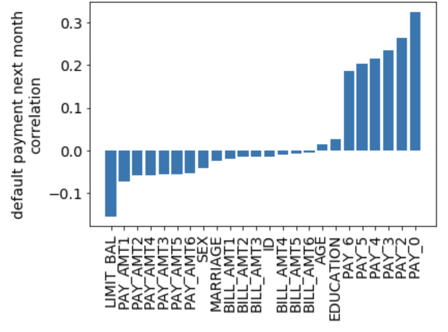

# C05T02 Lesson Learned
__John T. Leonad__

In this task (C05T02) we dived deeper into jupyter notebook with python to perform exploratory data analysis (EDA) on the credit load default data from Credit One.

Overall, the steps were actually quite similar to those performed in the first task of this course, here, they were just stated more explicitly. Because of this, many of the insights & plots generated in this notebook are described/shown in the presentation from task 1. 

For extracting key business insights, the correlation coefficients are probably the most valuable. Specifically, slicing out the "default payment next month" correlation coefficients for each feature, shown in the figure below, gives us insight into the importance of each feature.

In the figure above, we can see that the "Pay_#" features have the strongest positive correlations with defaulting, while "LIMIT BAL" has the strongest negative correlation with defaults.

Aside from the business insights stated above, some more technical lessons learned are:

1. Using dictionaries to collect/specify the names for your headers and features can make interacting with your data frame and setting up processing pipelines easier
2. Whenever you're coding, you should minimize the times you are repeating yourself. To do this, you should leverage loops and functions. Loops can be particularly useful when you are generating the same style plots on many different columns of data.
3. The seabon package's pair-plot can be a good way to visualize the cross-correlations of features and labels, however visualizing the trends can become difficult when you have >10 columns of interest. For these cases, simply viewing the correlation matrices with the correlation coefficient strength plotting on a color bar, can give you a simplified and cleaner visualization of the cross correlations and trends in the data.