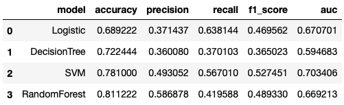
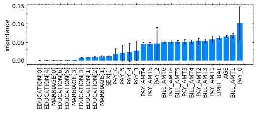
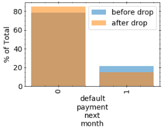

#
 Customer Default Identification 

__John T. Leonard__ 

__UTA Data Analytics__ 
 

__C05T03__

## Overview
Credit One has observed an increase in customer credit default rates recently & has asked our team to determine the root cause & see if the defaults can be predicted. In this report, we review the machine learning methods & results used to give insight into the Credit One defaults.

## Method
Here, our objective was to develop a model which would give insight into the importance of features in determening credit default, and allow us to predict credit default. To do this we leveraged a custom build API called JLpyUtils, which automates a number of standard feature engineering and model selections steps for machine learning. 

Prior to training our models of interest, we passed our dataset through a feature engineering pipeline which performed 5 steps: (1) label encoding (transform text-based data to numerical data), (2) Scaling (here, we use a [RobustScaler](https://scikit-learn.org/stable/modules/generated/sklearn.preprocessing.RobustScaler.html)), (3) imputing categorical features (i.e. filling NaN/missing values, where we used the 'most\_frequent' imputation method in this problem), (4) imputing continuous features (here, we used the median value for imputing missing continuous feature values), and (5) one hot encoding. Following this inital pipeline, we also applied a correlation coeff. threshold filter to drop features with a absolute cross-correlation coeff. > 0.95. This resulted in the features 'BILL\_AMT2', 'SEX[2]', and 'MARRIAGE[2]' being dropped based on their absolute cross correlation with 'BILL\_AMT1', 'SEX[1]', and 'MARRIAGE[1]', respectively. 

Following the feature engineering, we performed a train/test split, followed by a random oversample class balancing operation on the testing set. This class balancing operation ensured that our models would not simply learn to predict all non-default, since the majority of customers did not default.

Finally, after train-test splitting and balancing our label classes, we ran a model selection pipeline evaluating 4 different models: Logistic regression, support-vector-machine (SVM), Decision Tree, and Random Forest. On each of these models, we performed a hyperparameter grid-search with 4-fold cross validation.

Following training, and selection of the best set of hyperparameters for each type of model, we inspected the key metrics of each best model, which are shown in the table below.

__Grid Search CV Model Metrics__ 

Based on these results, we chose the Random Forest model as the best model for further evaluation.

## Business Insights
Using the best model discussed in the previous section, we can analyze the importance of the various features definig our customers. The bar chart below shows a breakdown of such feature importance

__Random Forest Feature Importance__ 

In the bar chart above, we can see the 3 most important features contributing to credit default are PAY\_0, BILL\_AMT1, and AGE. More specifically, by inspecting the correlation coeff. for each of these features we can observe that a higher PAY\_0 ammount implies a higher likelyhood of default. Furthermore, a lower Bill\_AMT1 implies a higher risk of default. Finally, younger people are generally more likely to default on payments. 
It should be noted that the statements above are general guided principles, since there are obviously many features that contribute to a persons risk of default, and thus the model should be used for a more accurate assessment of an individuals risk. 

Aside from the most important features, we can also gain insight by considering the least important features. Here, we note that all education categories, sex, and marriage have little to no impact on a persons credit risk. This implies that we can safely ignore education, sex, and marital status in assessing credit risk in the future.

Beyond inspecting the importance of various features on default, we can also leverage the model to see how maximize success for Credit One. Specifically, if we use the model to drop/exclude all applicants the model predicts will default, we can reduce the % of defaults that occur. The comparison of defaults before and after we drop the persons who we predict will default is shown in the bar chart below.

Based on the results above, if we decide to drop/deny any customers who the model predicts will default on their loan, we can reduce the number of defaults by ~1.5X (from 22% to 15%)

## Conclusion
We have outlined the methods we used for feature engineering & model selection. Furthermore, we described the business insights gained by using the best model from our model selection process. Most importantly, we described which features could be ignored from future analysis, and which features are the most important to focus on. Additionally, we saw that by using the model we can expect to reduce the % of default payments users by ~1.5X.